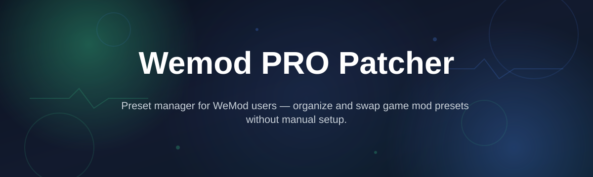
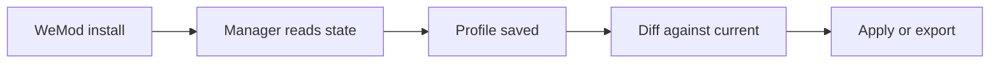

# wemod-preset-manager

*Italic one-liner: A focused desktop companion for WeMod users who want their PRO patcher settings organized, portable, and easy to restore after a reinstall.*

## What this is

Wemod-preset-manager is a small Windows desktop utility built around the **Wemod PRO Patcher** workflow. It does not try to replace WeMod or its trainer library — it sits beside it and manages the preset files, hotkey layouts, and Patcher configuration values that people rebuild by hand every time they switch machines, reinstall Windows, or start keeping more than one game profile.

In practice, that means you point the manager at your WeMod install directory (or a folder of exported presets), and it stores your Patcher settings as named profiles. Switching from a casual single-player setup to a streaming-tuned one is then a matter of loading a profile instead of re-ticking dozens of toggles. Everything lives locally in plain files, so nothing here touches another user's data and nothing phones home.

<strong>Why a separate manager exists</strong>

WeMod itself handles trainers fine. What it has never been good at is remembering a *shape* — a specific combination of Patcher toggles, export paths, and hotkeys that you tuned once and want back later. If you have ever lost that setup after a `C:\` wipe, you already know the problem this repo is aimed at. The manager keeps those combinations addressable by name and version, and lets you diff two profiles before applying one.

  

The button above opens the project page where the current build is published for download.

## Who it is for

- **Single-player tinkerers** who keep several Patcher configurations for different games and want them one click apart.
- **People who reinstall Windows often** and are tired of redoing WeMod PRO Patcher setup from memory.
- **Multi-account households** sharing one PC, where each person wants their own named preset rather than editing the same one.
- **Creators and streamers** who keep a "clean capture" profile alongside a normal one and swap between them per session.
- **Anyone migrating to a new laptop** who wants to carry a small folder of presets instead of a screenshot album.

## What you can do

- **Save the current Patcher state as a named profile** with a timestamp and an optional note.
- **Load any saved profile** back into your WeMod install in a single action, with a confirmation prompt showing what will change.
- **Compare two profiles side by side** so you can see exactly which toggles differ before committing.
- **Export the whole profile set** to a portable folder for backup or transfer to another PC.
- **Import profiles back** from that folder, merging rather than overwriting by default.
- **Organize by game or by purpose**, using tags like `coop`, `stream`, `testing`.
- **Keep an automatic rotation** of the last N states, so a bad load is one keystroke away from being undone.
- **Run entirely offline** — no account, no telemetry, no background service.

## Getting started

1. Open the project page using the download button above.
2. Grab the latest `wemod-preset-manager` release archive for Windows.
3. Extract it somewhere you control, for example `C:\Tools\wemod-preset-manager`.
4. Run the executable and point it at your WeMod install directory on first launch.
5. Save your current Patcher configuration as a profile named something like `default` so you always have a known-good baseline.

<strong>A first profile in five minutes</strong>

Start WeMod once, open the PRO Patcher panel, and set things up the way you actually like them. Close WeMod, run the manager, and choose **Capture current state**. Name it `baseline`, add the tag `everyday`, and save. Now change a couple of Patcher toggles in WeMod, capture again as `experiment`, and use the compare view to see the difference between the two. That diff view is the part most people end up using daily — it turns "did I already change this?" into a two-second check instead of a memory test.

## Requirements

- **Windows 10 or Windows 11**, 64-bit.
- **A working WeMod installation** on the same machine (the manager reads and writes its settings directory).
- Standalone build — no Python, no Node, no .NET toolchain to install yourself.
- Roughly 60 MB of free disk space, mostly for snapshot history.
- No administrator rights needed for normal use; only if your WeMod folder sits under a protected path.

## How it works

1. On launch, the manager locates your WeMod settings directory or asks you to confirm it once.
2. It reads the current Patcher-related values and hashes them into a snapshot.
3. When you save a profile, the snapshot is written to a local profiles folder with a name, tags, and a timestamp.
4. Loading a profile writes those values back, after showing you a diff against what is currently in place.
5. Exported profile sets are plain folders — copy them anywhere, import them later.

## FAQ

**Is wemod-preset-manager part of WeMod?**
No. It is an independent, community-built utility that works alongside the WeMod PRO Patcher configuration on your own machine. It is not affiliated with or endorsed by WeMod.

**Does it change game files?**
No. It manages Patcher configuration values and preset profiles. It does not touch game executables.

**Will it break my existing WeMod setup?**
The manager keeps a rolling history and asks for confirmation before applying a profile, so a mistake is reversible. Still, back up your settings folder the first time you use it.

**Can I move my profiles to another PC?**
Yes — export the profile set as a folder, copy it over, and import on the new machine. Import merges by default so it will not silently overwrite profiles that already exist there.

**Does it need an internet connection?**
No. Everything runs locally, and profiles are stored as ordinary files in a folder you choose.

## Troubleshooting

- **The manager cannot find my WeMod folder.** Point it manually in settings. Custom install locations are common, and the auto-detect step only covers default paths.
- **A profile loads but a few toggles look unchanged.** That usually means those values live outside the Patcher settings file. Re-capture the state while WeMod is closed so the manager sees the settled values.
- **Import says a profile already exists.** That is the merge protection working. Rename the incoming profile, or choose the overwrite option explicitly.
- **The app opens a blank window.** Make sure you extracted the archive instead of running it from inside a compressed folder; the build expects its sidecar files to sit next to the executable.

## License

Released under the [MIT License](LICENSE).

This project is an independent utility for managing WeMod PRO Patcher configuration locally. It is not affiliated with WeMod, and it ships no game content and no third-party trainer files. You are responsible for how you use it on your own system.

  

